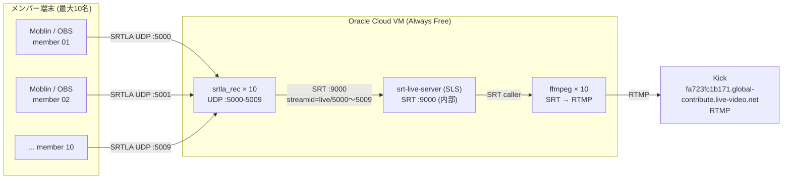

# SRTLA リレーサーバー構成

**更新日**: 2026-05-07  
**インフラ**: Oracle Cloud Always Free Tier (ARM Ampere A1 / Ubuntu 22.04)

---

## 全体構成図

---

## コンポーネント役割

| コンポーネント | リポジトリ / パッケージ | 役割 |
|---|---|---|
| srtla_rec | github.com/BELABOX/srtla | SRTLA受信・ボンディング集約・SRT変換 |
| srt-live-server (SLS) | github.com/Edward-Wu/srt-live-server | SRT受信・stream ID ルーティング |
| ffmpeg | apt install ffmpeg | SRT pull → RTMP push（Kick向け） |
| ufw | Ubuntu 組み込み | ファイアウォール（UDP 5000-5009 開放） |
| vnstat | apt install vnstat | 帯域使用量監視 |

---

## ポート割当

| member_id | SRTLA 受信ポート | SLS stream ID | systemd ユニット |
|---|---|---|---|
| 01 | UDP 5000 | live/5000 | srtla-rec@5000.service |
| 02 | UDP 5001 | live/5001 | srtla-rec@5001.service |
| 03 | UDP 5002 | live/5002 | srtla-rec@5002.service |
| 04 | UDP 5003 | live/5003 | srtla-rec@5003.service |
| 05 | UDP 5004 | live/5004 | srtla-rec@5004.service |
| 06 | UDP 5005 | live/5005 | srtla-rec@5005.service |
| 07 | UDP 5006 | live/5006 | srtla-rec@5006.service |
| 08 | UDP 5007 | live/5007 | srtla-rec@5007.service |
| 09 | UDP 5008 | live/5008 | srtla-rec@5008.service |
| 10 | UDP 5009 | live/5009 | srtla-rec@5009.service |

SLS は内部ポート TCP/UDP **9000** で待受。外部には公開しない（ufw デフォルト DENY）。

---

## 帯域計算

全員同時配信・6時間/日フル稼働の最悪ケース試算。

| 指標 | 計算式 | 結果 |
|---|---|---|
| ピーク帯域 | 10名 × 6Mbps | **60Mbps** |
| 1時間あたりアウトバウンド | 60Mbps ÷ 8 × 3,600秒 | 27GB/時 |
| 1日あたり（6時間稼働） | 27GB × 6 | 162GB/日 |
| 月間アウトバウンド | 162GB × 30日 | **4.86TB/月** |
| Oracle Free Tier 枠 | — | 10TB/月（アウトバウンド） |
| **余裕** | 10 − 4.86 | **+5.14TB（消費率 49%）** |

> Oracle Cloud Always Free Tier の帯域計測はアウトバウンドのみ。インバウンド（メンバー→VM）は計測外。  
> ピーク全員同時配信でも枠の半分以下に収まり、突発的な配信延長にも十分な余裕がある。

---

## セキュリティ設計

- SRTLA ポート（UDP 5000-5009）のみ外部公開
- SSH（TCP 22）のみ管理用に開放
- SLS（9000）・ffmpeg 制御は VM 内部ループバックのみ
- Stream Key は環境変数 `KICK_KEY_01` 〜 `KICK_KEY_10` で管理（ファイル・コードに平文不可）
- `stream_keys/` ディレクトリは `.gitignore` 除外済み
